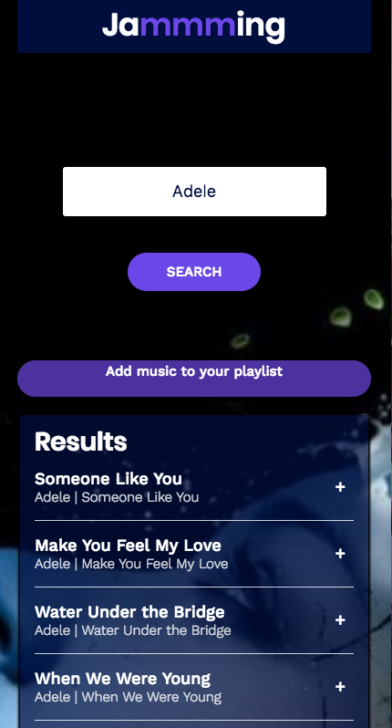

#Jammming

<h1>Overall</h1>
<p>React application utilizing components for dynamic data without refresh of entire page.</p>
<p>Features Spotify API to search a specific artist, album or song to render list of 20 songs that relate to search.</p>
<p>Implements Spotify OAuth2 so users can save playlists to their Spotify account.</p>
<p>Install Yarn if branch</p>

<h1>Difficulties</h1>
<ul>Adding Spotify OAuth2 while using access tokens for login. Searched documentation for best way to implement OAuth.</ul>

<h1>Coding Snippets</h1>
<h3>Obtaining access token from Spotify API using personal client ID and window.location</h3>

``` javascript

getAccessToken() {
    if (accessToken) {
      return accessToken;
    }

    const accessTokenMatch = window.location.href.match(/access_token=([^&]*)/);
    const expiresInMatch = window.location.href.match(/expires_in=([^&]*)/);
    if (accessTokenMatch && expiresInMatch) {
      accessToken = accessTokenMatch[1];
      const expiresIn = Number(expiresInMatch[1]);
      window.setTimeout(() => accessToken = '', expiresIn * 1000);
      window.history.pushState('Access Token', null, '/'); // This clears the parameters, allowing us to grab a new access token when it expires.
      return accessToken;
    } else {
      const accessUrl = `https://accounts.spotify.com/authorize?client_id=${CLIENT_ID}&response_type=token&scope=playlist-modify-public&redirect_uri=http://localhost:3000`;
      window.location = accessUrl;
    }
  },
  
 ```
 
 <br />
 <h3>Main component accepting multiple states (message, search results, playlist tracks, etc) while passing props to other components that are all interacting.</h3>
 
 ```javascript 
 
 render() {
  return (
    <div className="App">
      <h1>Ja<span className="highlight">mmm</span>ing</h1>
      <div className="search-container">
          <SearchBar spotifySearch={this.spotifySearch}/>
          <div className="Error-Message">{this.state.message}</div>

          <div className="App-playlist">
              <SearchResults 
                  searchResults={this.state.searchResults} 
                  onAdd={this.addTrack}
              />

              <Playlist 
                  playlistTracks={this.state.playlistTracks}
                  onRemove={this.removeTrack}
                  onNameChange={this.upsdatePlaylistName}
                  onSave={this.savePlaylist}
              />

           </div>
      </div>
    </div>
  );
}
  
 ```

<h1>Screenshots</h1>
<h3>Desktop version of application with search results of Adele and adding a few songs to a new playlist.</h3>

<br />

<h3>Mobile version of same search results.</h3>

<br />

<h3>Mobile version of playlist created through search results renamed as "Some of my favs".</h3>

<br />

<h3>Spotify application showing that "Some of my favs" playlist was directly added to Spotify account from Jammming application.</h3>

<br />
